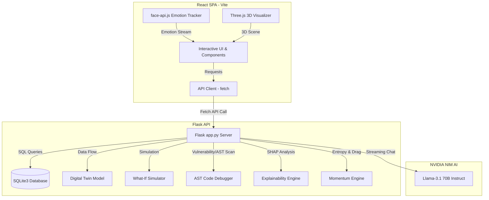

# SARVAM-X: Cognitive Intelligence Hub & Security Sentinel

SARVAM-X is a high-fidelity, interdisciplinary AI platform combining two primary modules:
1. **SARVAM Cognitive Suite**: A personalized AI learning mirror featuring digital twin metrics, a predictive simulator, an AST-based Python debugger, and an AI Mentor Panel with real-time emotion-tracking (via face-api.js) and streaming LLM guidance.
2. **TRINETRA Secure Sentinel**: An AI-driven cybersecurity and verification suite featuring NLP-based fake news classification, secure code static vulnerability analysis, and real-time security trend visualizations.

---

## 🏗️ Architecture Overview

The system is built as a split-stack application:
- **Frontend (`/client`)**: React SPA bundled using Vite, styled with Tailwind CSS, utilizing Three.js/Spline for 3D visual assets, Chart.js for data visualization, and vladmandic's `face-api.js` for on-device emotional mapping.
- **Backend (`/backend`)**: Flask REST API utilizing SQLite3 for persistence, scikit-learn & SHAP for local machine learning model explainability, and OpenAI's integration with NVIDIA NIM endpoints for streaming dialogue.
- **Distribution (`/frontend`)**: The React SPA compiled assets are outputted to `/frontend`, which is directly mounted and served by the Flask app to prevent CORS issues and simplify deployment.



---

## 🌟 Key Features

### 1. SARVAM Cognitive Suite
- **Digital Twin**: Generates a virtual model of the student's proficiency, calculating predicted test scores and knowledge gaps using mock study sessions.
- **Explainable AI (XAI)**: Visualizes model inputs using SHAP values (accuracy, hours, subject weight) to show *why* the AI predicts a certain score.
- **What-If Simulator**: Interactive range sliders that simulate how adding extra hours or increasing focus shifts future mastery paths.
- **AST Debugger**: Parses Python code for syntax and structural issues, generating step-by-step trace logs.
- **Cognitive Mirror (AI Mentor)**: Stream-to-text chat console offering low-latency feedback. Integrates a webcam feed running `face-api.js` to detect facial emotions (Neutral, Happy, Sad, Angry, Surprised) and adapt the mentor's tone dynamically.

### 2. TRINETRA Secure Sentinel
- **NLP Fake News Detector**: Evaluates text for misinformation, highlighting sensationalism and factual probability using gauge charts.
- **Explainable Sentiment**: Shows XAI indicators explaining positive/negative lexical framing.
- **Static Code Vulnerability Scanner**: Analyzes code files for buffer overflows, hardcoded credentials, SQL injection patterns, and command injection, generating risk registers.

---

## 🚀 Setup & Execution

### Prerequisites
- Node.js (v18+)
- Python (3.10+)

### Backend Installation & Startup
1. Navigate to the backend directory:
   ```bash
   cd backend
   ```
2. Create and activate a Python virtual environment:
   ```bash
   python -m venv .venv
   # On Windows (PowerShell)
   .venv\Scripts\Activate.ps1
   # On macOS/Linux
   source .venv/bin/activate
   ```
3. Install dependencies:
   ```bash
   pip install -r requirements.txt
   ```
4. Start the backend server (SQLite database will initialize automatically):
   ```bash
   python app.py
   ```
   The backend will run on `http://localhost:5000`.

### Client Installation & Production Build
1. Navigate to the client directory:
   ```bash
   cd client
   ```
2. Install npm dependencies:
   ```bash
   npm install
   ```
3. Build the production package:
   ```bash
   npm run build
   ```
   This compiles the React SPA and writes all static bundle assets directly into `../frontend`. The Flask server serves these assets instantly at `http://localhost:5000`.

---

## 🛠️ Tech Stack Details

- **Frontend Core**: React 18, Vite, TypeScript 5
- **Frontend Rendering & Animation**: Three.js, Canvas, Chart.js (react-chartjs-2)
- **CSS Framework**: Tailwind CSS
- **Local Emotion AI**: `face-api.js` (loaded dynamically from Vladmandic CDN)
- **Backend API**: Flask 3, Flask-CORS 4
- **Machine Learning Core**: Scikit-Learn 1.5, SHAP 0.46, NumPy 2.1, Pandas 2.2
- **Database**: SQLite3
- **Dialogue Engine**: OpenAI client configured to Nvidia NIM endpoints (`meta/llama-3.1-70b-instruct`)
