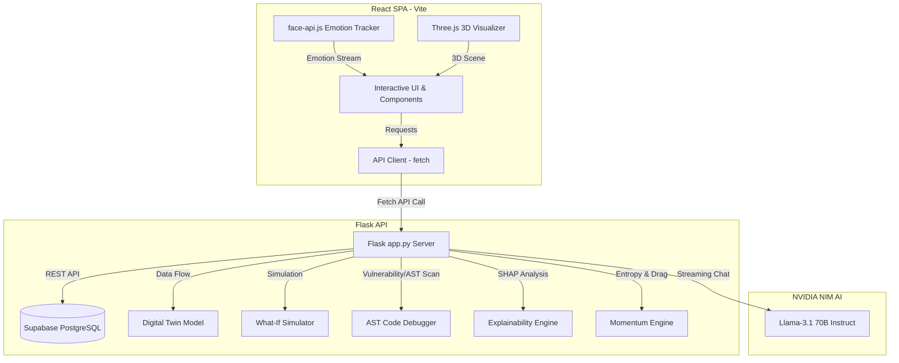

# SARVAM-X: Cognitive Intelligence Hub & Security Sentinel

SARVAM-X is a high-fidelity, interdisciplinary AI platform combining two primary modules:
1. **SARVAM Cognitive Suite**: A personalized AI learning mirror featuring digital twin metrics, a predictive simulator, an AST-based Python debugger, and an AI Mentor Panel with real-time emotion-tracking (via face-api.js) and streaming LLM guidance.
2. **TRINETRA Secure Sentinel**: An AI-driven cybersecurity and verification suite featuring NLP-based fake news classification, secure code static vulnerability analysis, and real-time security trend visualizations.

---

## 🏗️ Architecture Overview

The system is built as a split-stack application:
- **Frontend (`/client`)**: React SPA bundled using Vite, styled with Tailwind CSS, utilizing Three.js/Spline for 3D visual assets, Chart.js for data visualization, and vladmandic's `face-api.js` for on-device emotional mapping.
- **Backend (`/backend`)**: Flask REST API utilizing **Supabase** (PostgreSQL) for persistence via its REST API, scikit-learn & SHAP for local machine learning model explainability, and OpenAI's integration with NVIDIA NIM endpoints for streaming dialogue.



---

## 🌟 Key Features

### 1. SARVAM Cognitive Suite
- **Digital Twin**: Generates a virtual model of the student's proficiency, calculating predicted test scores and knowledge gaps using mock study sessions.
- **Explainable AI (XAI)**: Visualizes model inputs using SHAP values (accuracy, hours, subject weight) to show *why* the AI predicts a certain score.
- **What-If Simulator**: Interactive range sliders that simulate how adding extra hours or increasing focus shifts future mastery paths.
- **AST Debugger**: Parses Python code for syntax and structural issues, generating step-by-step trace logs.
- **Cognitive Mirror (AI Mentor)**: Stream-to-text chat console offering low-latency feedback. Integrates a webcam feed running `face-api.js` to detect facial emotions and adapt the mentor's tone dynamically.

### 2. TRINETRA Secure Sentinel
- **NLP Fake News Detector**: Evaluates text for misinformation, highlighting sensationalism and factual probability using gauge charts.
- **Explainable Sentiment**: Shows XAI indicators explaining positive/negative lexical framing.
- **Static Code Vulnerability Scanner**: Analyzes code files for buffer overflows, hardcoded credentials, SQL injection patterns, and command injection, generating risk registers.

---

## 🎨 Frontend Design & Structure

- **Cyberpunk Dark Mode**: Custom neon palettes featuring `primary` (emerald-500 glow for learning success) and `purple` (amethyst-500 glow for security threat sentinel).
- **Glassmorphism**: Backdrop blur structures with semi-transparent borders (`bg-white/[0.02] backdrop-blur-2xl border border-white/[0.05]`).
- **Three.js Visualizers**: Floating abstract 3D models rendered dynamically inside the Authentication frame (`ThreeModel.tsx`).
- **Interactive Graphs**: Responsive line, bar, radar, and gauge visual indicators provided by `react-chartjs-2` and `Chart.js`.
- **Dynamic Face Emotion Tracker**: Loads `@vladmandic/face-api` dynamically from the CDN to avoid bundling overhead. Emits emotion classes (`Neutral`, `Happy`, `Sad`, `Angry`, etc.) to modify the AI Mentor chat prompt dynamically.

---

## ⚙️ Backend Core Modules & API

### 1. Digital Twin & What-If Simulator (`models/twin_model.py`)
- **Digital Twin**: Models students using their historical learning metrics. Uses a mock linear regression model to predict current score levels and locate weak learning domains.
- **What-If Simulator**: Models projected scores by adjusting focus parameters. Returns forecasted score lifts and reduction in days to reach mastery.

### 2. Behavioral Entropy Engine (`models/momentum.py`)
- **Momentum Score**: Calculated from study velocity (questions/day) and focus consistency (low entropy).
- **Entropy Indicator**: Uses NumPy to calculate the Coefficient of Variation (CV) across session durations and accuracies. Higher entropy implies erratic, unfocused learning behavior.

### 3. Explainability Engine (`models/explainer.py`)
- **SHAP (SHapley Additive exPlanations)**: Calculates positive/negative attribute weights determining why a score prediction was made.

### 4. Code AST Debugger (`models/debugger.py`)
- **Abstract Syntax Trees (AST)**: Utilizes Python's native `ast` library to parse inputs, catch structural logic errors, and calculate cyclomatic complexity.

### Main API Endpoints
- **Authentication**: `POST /api/auth/signup`, `POST /api/auth/login`, `GET /api/user/<user_id>`
- **SARVAM Suite Data**: `GET /api/dashboard/<user_id>`, `POST /api/session`, `GET /api/history/<user_id>`, `POST /api/predict`, `POST /api/whatif`, `GET /api/heatmap/<user_id>`, `GET /api/momentum/<user_id>`
- **Cognitive Mirror Dialogue**: `POST /api/chat` (Returns a `text/event-stream` returning generated speech tokens from Llama 3.1 70B via Nvidia NIM).

---

## 🚀 Setup & Execution

### Prerequisites
- Node.js (v18+)
- Python (3.10+)
- Supabase Project & NVIDIA NIM API Keys

### Backend Installation & Startup
1. Navigate to the backend directory and activate virtual environment:
   ```bash
   cd backend
   python -m venv .venv
   .venv\Scripts\Activate.ps1  # Windows
   source .venv/bin/activate   # macOS/Linux
   ```
2. Install dependencies:
   ```bash
   pip install -r requirements.txt
   ```
3. Environment Variables:
   Create a `.env` file in the `/backend` directory:
   ```
   SUPABASE_URL=your_supabase_project_url
   SUPABASE_KEY=your_supabase_anon_key
   NVIDIA_THINKING_API_KEY=your_nvidia_api_key
   NVIDIA_SPEAKING_API_KEY=your_nvidia_api_key
   ```
4. Start the backend server:
   ```bash
   python app.py
   ```

### Client Installation & Development
1. Navigate to the client directory:
   ```bash
   cd client
   npm install
   ```
2. Start the development server:
   ```bash
   npm run dev
   ```

---

## 🛠️ Tech Stack Details

- **Frontend Core**: React 18, Vite, TypeScript 5
- **Frontend Rendering**: Three.js, Canvas, Chart.js (react-chartjs-2)
- **CSS Framework**: Tailwind CSS
- **Local Emotion AI**: `face-api.js`
- **Backend API**: Flask 3, Flask-CORS 4
- **Machine Learning Core**: Scikit-Learn 1.5, SHAP 0.46, NumPy 2.1, Pandas 2.2
- **Database**: Supabase (PostgreSQL REST API)
- **Dialogue Engine**: OpenAI client configured to Nvidia NIM endpoints (`meta/llama-3.1-70b-instruct`)
